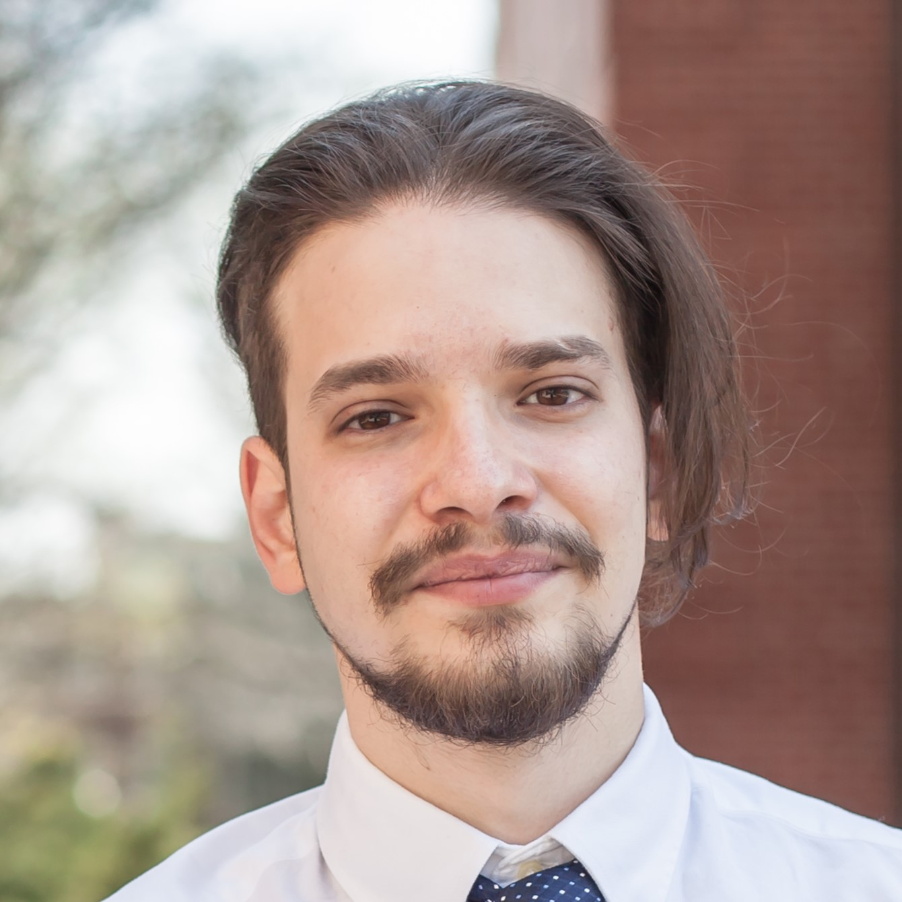

# Aside

{width="400"}

<i class='fas fa-download'></i> [Download a PDF of this CV](https://github.com/nstrayer/cv/raw/master/strayer_cv.pdf)

## Contact Info {#contact}

-   <i class="fa fa-envelope"></i> [fsetti\@fordham.edu](or%20%5Bfsetti@fordham.edu%5D(mailto:fsetti@fordham.edu)%7B.email%7D)
-   <i class="fa fa-github"></i> [github](https://github.com/quinix45)
-   <i class="fa fa-linkedin"></i> [linkedin](https://www.linkedin.com/in/fabio-setti-0a0a85236/)
-   <i class="fa fa-phone"></i> +1 332-209-8249

## Skills {#skills}

-   Psychology Research, statistical analysis, item response theory, psychometrics, data cleaning.

-   Experienced in R, Python, LaTeX, SPSS, office package

## Disclaimer {#disclaimer}

Last updated on `r Sys.Date()`.

# Main

## Fabio Setti {#title}

### PhD student in Psychometrics and Quantitative Psychology at Fordham University

I am currently enrolled in the Psychometrics and Quantitative Psychology (PQP) PhD program at Fordham University. I love doing both applied and methodological research. I mostly focus on **psychometric measurement** and the implementation of **appropriate statistical** **methods** in the **field of psychology**.

## Education {data-icon="graduation-cap" data-concise="true"}

### Universita' degli Studi di Padova

B.S. in psychological science

Padova, Italy

2016 - 2019

### Illinois State University

M.S. in Quantitative Psychology

Bloomington, IL

2020 - 2022

Thesis: The influene of the facets of opennes to experience on music preference

### Fordham University (in progress)

PhD in Psychometrics and Quantitative Psychology

New York, NY

2022 - Today

## Research Experience {data-icon="laptop"}

### Master's Thesis Research

Illinois State University

Bloomington, IL

2021 - 2022

-   Cunducted independent data collection and data analysis for Master's thesis.

### Research Assistant

Northwestern University

Evanstone, IL

Summer 2023

-   Worked on validation of SCENTinel, a quick, self-administered, test to screen for abnormal olfaction.

## Professional Experience {data-icon="suitcase"}

### Human Resources Assistant internship

Uomo e Impresa s.r.l.

Treviso, Italy

4/2019 - 7/2019

::: concise
• Resumes' translation from Italian to English

• Research and evaluation of various skills-assessment inventories and test batteries commercially available

• Basic data analysis
:::

### Editorial Assistant for Innovation in Science teacher Education (ISTE)

Center for Mathematics, Science, and Technology

Bloomington, IL

4/2021 - 5/2022

::: concise
• Reviewing articles submitted for publication

• Checking that submitted articles conform to APA guidelines

• Uploading publication ready articles to the WordPress ISTE website and making sure that formatting follows APA guidelines
:::

## Teaching Experience {data-icon="chalkboard-teacher"}

### Lab Instructor for PSYC 2000 (intro to statistics)

Fordham University

New York, NY

Fall 2022 - Spring 2023

-   Teaching students practical examples of how statistics are applied in psychology.
-   Teaching student to analyze data with SPSS.

### Intro to R Workshop

Fordham University

New York, NY

Spring 2023

::: concise
• Preparation of materials for 2 of the 4 part R introduction workshop (slides and practice exercises).

• Presentation of *data manipulation in R* (part 2) and *plotting in R* (part 3).
:::

## Publications and Poster Presentations {style="text-align: left"}

::: {style="padding-left: 0.26in"}
> Setti, F., & Kahn, J. H. (2023). Evaluating how facets of openness to experience predict music preference. *Musicae Scientiae* (online first).
>
> Setti, F., Kahn, J. (2022, Aprl 21-23). Influence of Facets of Openness to Experience on Music Preference [poster presentation]. Midwestern Psychological Association Annual conference, Chicago, IL, United States.
:::

